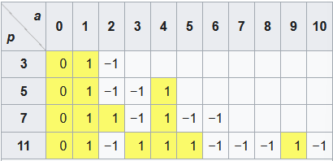

# Greatest Common Divisor

- Ước chung lớn nhất là số lớn nhất mà 2 số nguyên (a, b) có thể chia hết cho.
- Ex: a = 12, b = 8, ước của a: {1, 2, 4, 6, 12}, b: {1, 2, 4, 8} => số lớn nhất trong cả 2 tập hợp a, b có thể chia hết là 4 vậy 'GCD(12,8)=4'
- Nếu cả 2 số đều là số nguyên tố, vì số nguyên tố chỉ chia được cho 1 và chính nó nên 'GCD(11,17)=1', ta gọi đó là 2 số nguyên tố cùng nhau
- Còn nếu chỉ có a hoặc b là số nguyên tố và 'b < a' thì a và b cũng là 2 số nguyên tố cùng nhau

- thuật toán Eculid dựa trên nguyên tắc là ước chung lớn nhất của 2 số nguyên khôgn thay đổi khi thay số lớn hơn bằng hiệu của nó với số nhỏ hơn.
- EX: a=12, b=8:
```
    12 = 8 + 4
    8 = 4 + 4
    4 = 4 + 0
```

# Extended GCD

- Thuật toán Eculid mở rộng là cách tìm các số nguyên u, v sao cho:
    ```a*u + b*v = GCD(a,b)```
- để tìm GCD(81,57) ta sử dụng thuật toán Eculid như sau:
    ```
    81 = 1(57) + 24
    57 = 2(24) + 9
    24 = 2(9) + 6
    9 = 1(6) + 3
    6 = 2(3) + 0```
- Bằng cách đảo ngược các bước trong thuật toán Eculid, ta có thể tìm được các số nguyên u, v này. EX:
    ```
    3 = 9 -1(6)
    3 = 9 - 1(24 - 2(9)) = 3(9) - 1(24)
    3 = 3( 57 - 2(24)) - 1(24) = 3(57) - 7(24)
    3 = 3(57) - 7( 81 - 1(57)) = 10(57) -7(81)```
vậy ta có thể tìm được u=10, v=-7 

==> ```81*10 + (-7)*57 = 3```


# Modular Arithmetic 

- với 1 số nguyên m>1, gọi là modulo, 2 số nguyên a,b gọi là đồng dư của module m, nếu hiệu của chúng chia hết cho n
- ký hiệu: 
    ```a ≡ b (mod m)```
- Nếu a chia hết cho m ta có thể viết rằng m|a thì 'a ≡ 0 (mod m)'
- EX:
    ```38 ≡ 14 (mod 12)```
nếu 38/12 dư 14 và 38-14 sẽ chia hết cho 12 vậy 38 và 14 là đồng dư modulo 12 


### Định lý littel Fermat

- Nếu p là 1 số nguyên tố thì với số nguyên a bất kỳ, a^p - a sẽ chia hết cho p.
-  ```a**p ≡ a (mod p)```
- EX: '7**17 ≡ 7 (mod 17)'
- Nếu p là 1 số nguyên tố, a là 1 số nguyên không chia hết cho p, thì 'a^(p-1) -1' chia hết cho p.
- ```a**(p-1) ≡ 1 (mod p)```
- EX: '7**16 ≡ 1 (mod 17)'


# Modular Inverting

- phép nghịch đảo modulo là: với mọi phần từ g sẽ luôn tồn tại 1 phần từ d duy nhất sao cho:
        ```g * d ≡ 1 (mod p)```
có thể nói d chính là nghịch đảo modulo của g với modulo p
- có thể ký hiệu d = g^-1 ```g * g**(-1) ≡ 1 (mod p)```
- EX: '7 * 8 = 56 ≡ 1 (mod 11)'


# Quadratic Residues

- Một số nguyên a được gọi là thặng dư bình phương của mod n nếu tồn tại 1 số nguyên x sao cho:
    ```x**2 ≡ a (mod n)```

### kí hiệu Legendre
- Kí hiệu legendre là 1 hàm nhận ba giá trị 1, 0, -1.
- Nếu p là 1 số nguyên tố lẻ và a là một số nguyên, thì ký hiệu (a/b) có thể nhận các gía trị:
    - 0 nếu p chia hết a, hay a là bội của p
    - 1 nếu a là thặng dư bậc 2 của modulo p
    - -1 nếu a không là thặng dư bậc 2

- Hàm legendre được định nghĩa như sau: (a/p) ≡ a**(p-1)/2 mod p với (a/p) = {1, 0, -1}



- có thể hiểu đơn giản là 3 giá trị của (a/p) là khi a**(p-1)/2 % p dư 1 hoặc 0 hoặc -1

- các tính chất của ký hiệu lengendre:
    1. (a*b)/p = (a/b) * (b/p)
    2. Nếu a ≡ b (mod p), thì (a/p) = (b/p)
    3. (1/p) = 1, (0/p) = 0
    4. (-1/p) = (-1)**(p-1)/2
        - = 1 khi p ≡ 1 (mod 4)
        - = -1 khi p ≡ 3 (mod 4)
    5. (2/p) = (-1)** (p**2 - 1)/8 
        - = 1 khi p ≡ 1 or 7 (mod 8)
        - = -1 khi p ≡ 3 or 5 (mod 8)
    6. Với snt lẻ p bất kỳ, (3/p) = (-1)**((p+1)/6) 
        - = 1 khi p ≡ 1 or 11 (mod 12)
        - = -1 khi p ≡ 5 or 7 (mod 12)
    7. Với snt lẻ p bất kỳ, (5/p) = (-1)**((p-2)/5)
        - = 1 khi p ≡ 1 or 4 (mod 5)
        - = -1 khi p ≡ 2 or 3 (mod 5)
    8. Với snt lẻ p bất kỳ, (7/p)
        - = 1 khi p ≡ 1, 3, 9, 19, 25 or 27 (mod 28)
        - = -1 khi p ≡ 5, 11, 13, 15, 17 or 23 (mod 28)
    9. nếu p và q là các snt lẻ thì (q/p) = (p/q) * (-1)**[((p-1)/2) * ((q-1)/2)]


# Chinese Remainder Theorem

- bản chất của định lý số dư Trung hoa là việc giải hệ phương trình đồng dư bậc nhất
    - x ≡ a1 (mod m1)
    - x ≡ a2 (mod m2)
    - x ≡ a3 (mod m3)

- hệ phương trình đồng dư trên có nghiệm duy nhất theo modulo 'M = m1 * m2 * ... * mk'

- là:
    ``` x ≡ a1*M1*y1 + a2*M2*y2 + ... + ak*Mk*yk```
- trong đó 
``` Mk = M/mk
    yk ≡ (Mk)**-1 (mod mk)
    (Mk)**-1 mod(mk) là nghịch đảo modulo Mk theo modulo mk 
    ==> yk ≡ (Mk)**-1 (mod mk) <=> yk*Mk ≡ 1 (mod mk)
```


